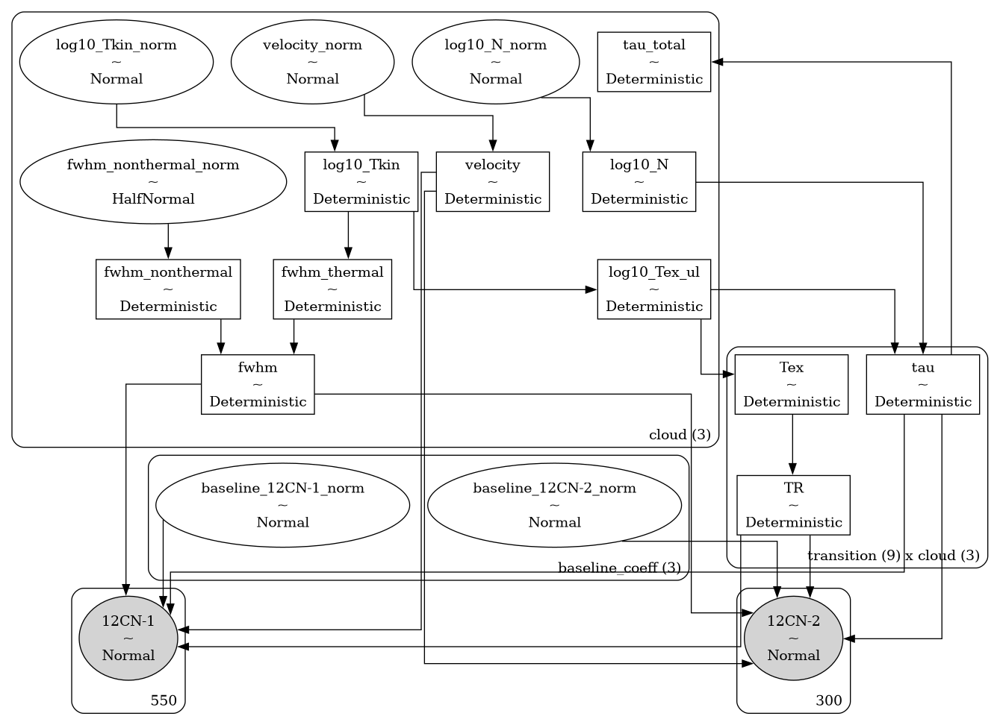
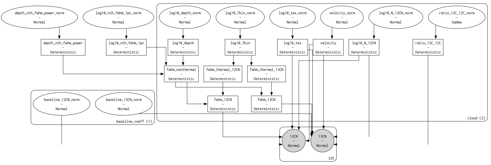

# bayes_cn_hfs <!-- omit in toc -->


[](https://bayes-cn-hfs.readthedocs.io/en/latest/?badge=latest)
[](https://codecov.io/gh/tvwenger/bayes_cn_hfs)

A Bayesian CN Hyperfine Spectroscopy Model

`bayes_cn_hfs` implements models to infer the physics of the interstellar medium from hyperfine spectroscopy observations of CN as well as the carbon isotopic ratio from observations of CN and $^{13}$CN.

- [Installation](#installation)
  - [Basic Installation](#basic-installation)
  - [Development installation](#development-installation)
- [Notes on Physics \& Radiative Transfer](#notes-on-physics--radiative-transfer)
- [Models](#models)
  - [Model Notes](#model-notes)
  - [`CNModel`](#cnmodel)
  - [`CNRatioModel`](#cnratiomodel)
  - [`ordered`](#ordered)
- [Syntax \& Examples](#syntax--examples)
- [Issues and Contributing](#issues-and-contributing)
- [License and Copyright](#license-and-copyright)


# Installation

## Basic Installation

Install with `pip` in a `conda` virtual environment:
```
conda create --name bayes_cn_hfs -c conda-forge pymc pip
conda activate bayes_cn_hfs
# Due to a bug in arviz, this fork is temporarily necessary
# See: https://github.com/arviz-devs/arviz/issues/2437
pip install git+https://github.com/tvwenger/arviz.git@plot_pair_reference_labels
pip install bayes_cn_hfs
```

## Development installation
Alternatively, download and unpack the [latest release](https://github.com/tvwenger/bayes_cn_hfs/releases/latest), or [fork the repository](https://docs.github.com/en/pull-requests/collaborating-with-pull-requests/working-with-forks/fork-a-repo) and contribute to the development of `bayes_cn_hfs`!

Install in a `conda` virtual environment:
```
conda env create -f environment.yml
conda activate bayes_cn_hfs-dev
pip install -e .
```

# Notes on Physics & Radiative Transfer

All models in `bayes_cn_hfs` apply the same physics and equations of radiative transfer.

The transition optical depth and source function are taken from [Magnum & Shirley (2015) section 2 and 3](https://ui.adsabs.harvard.edu/abs/2015PASP..127..266M/abstract).

The radiative transfer is calculated explicitly assuming an off-source background temperature `bg_temp` (see below) similar to [Magnum & Shirley (2015) equation 23](https://ui.adsabs.harvard.edu/abs/2015PASP..127..266M/abstract). By default, the clouds are ordered from *nearest* to *farthest*, so optical depth effects (i.e., self-absorption) may be present. We do not assume the Rayleigh-Jeans limit; the source radiation temperature is predicted explicitly and can account for observation effects (i.e., the models can predict brightness temperature ($T_B$) or corrected antenna temperature ($T_A^*$).

Models can assume local thermodynamic equilibrium (LTE). Under this assumption, the excitation temperature of all transitions is fixed at the kinetic temperature of the cloud.

Non-LTE effects are modeled by considering the column densities of all states and self-consistently solving for the excitation temperature of each transition. We can assume a common excitation temperature (CTEX) across all transitions, or we can allow for hyperfine anomalies by allowing the state column densities to deviate from the LTE values.

For the `CNRatioModel`, we can (1) assume LTE for both CN and $^{13}$CN, (2) do not assume CTEX for CN, but assume CTEX for $^{13}$CN at the average CN excitation temperature, or (3) do not assume CTEX for either species, but assume $^{13}$CN hyperfine anomalies are similar to those of CN.

Notably, since these are *forward models*, we do not make assumptions regarding the optical depth or the Rayleigh-Jeans limit. These effects, and the subsequent degeneracies and biases, are *predicted* by the model and thus *captured* in the inference. There is one exception: the `ordered` argument, [described below](#ordered).

# Models

The models provided by `bayes_cn_hfs` are implemented in the [`bayes_spec`](https://github.com/tvwenger/bayes_spec) framework. `bayes_spec` assumes that the source of spectral line emission can be decomposed into a series of "clouds", each of which is defined by a set of model parameters. Here we define the models available in `bayes_cn_hfs`.

## Model Notes

1. Non-thermal broadening is only considered when `prior_fwhm_nonthermal` is non-zero. By default, non-thermal broadening is not considered.
2. The `velocity` of a cloud can be challenging to identify when spectral lines are narrow and widely separated. We overcome this limitation by modeling the line profiles as a "pseudo-Voight" profile, which is a linear combination of a Gaussian and Lorentzian profile. The parameter `fwhm_L` is a latent hyper-parameter (shared among all clouds) that characterizes the width of the Lorentzian part of the line profile. When `fwhm_L` is zero, the line is perfectly Gaussian. This parameter produces line profile wings that may not be physical but nonetheless enable the optimization algorithms (i.e, MCMC) to converge more reliably and efficiently. Model solutions with non-zero `fwhm_L` should be scrutinized carefully. This feature can be turned off by supplying `None` (default) to `prior_fwhm_L`, in which case the line profiles are assumed Gaussian.
3. By default, the spectral RMS noise is not inferred, rather it is taken from the `noise` attribute of the passed `SpecData` datasets. If `prior_rms` is not None, then the spectral RMS noise of each dataset is inferred.
4. Hyperfine anomalies are treated as deviations from the LTE densities of each state. The value passed to `prior_log10_Tex` sets the average excitation temperature, `log10_Tex_ul`, and statistical weights of every transition, `LTE_weights` (i.e., the fraction of molecules in each state). Deviations from these weights are modeled as a Dirichlet distribution with a concentration parameter `LTE_weights/LTE_precision`, where `LTE_precision` is a cloud parameter that describes the scatter in state weights around the LTE values. A small `LTE_precision` implies a large concentration around `LTE_weights` such that the cloud is in LTE. A large `LTE_precision` value indicates deviations from LTE.
5. For the `CNRatioModel`, the $^{13}$CN excitation conditions are either (1) assumed constant across transitions with value `log10_Tex_ul` when `assume_CTEX_13CN=True` or (2) assumed to be similar to the excitation conditions of CN, with LTE deviations characterized by the same `LTE_precision` parameter.

## `CNModel`

The basic model is `CNModel`, a general purpose model for modelling hyperfine spectroscopic observations of CN or $^{13}$CN. The model assumes that the emission can be explained by the radiative transfer of emission through a series of isothermal, homogeneous clouds as well as a polynomial spectral baseline. The following diagram demonstrates the relationship between the free parameters (empty ellipses), deterministic quantities (rectangles), model predictions (filled ellipses), and observations (filled, round rectangles). Many of the parameters are internally normalized (and thus have names like `_norm`). The subsequent tables describe the model parameters in more detail.



| Cloud Parameter<br>`variable` | Parameter                                              | Units    | Prior, where<br>($p_0, p_1, \dots$) = `prior_{variable}`           | Default<br>`prior_{variable}` |
| :---------------------------- | :----------------------------------------------------- | :------- | :----------------------------------------------------------------- | :---------------------------- |
| `log10_N`                     | Total column density across all upper and lower states | `cm-2`   | $\log_{10}N \sim {\rm Normal}(\mu=p_0, \sigma=p_1)$                | `[13.5, 1.0]`                 |
| `log10_Tkin`                  | Kinetic temperature                                    | `K`      | $\log_{10}T_K \sim {\rm Normal}(\mu=p_0, \sigma=p_1)$              | `[1.0, 0.5]`                  |
| `velocity`                    | Velocity (same reference frame as data)                | `km s-1` | $V \sim {\rm Normal}(\mu=p_0, \sigma=p_1)$                         | `[0.0, 10.0]`                 |
| `fwhm_nonthermal`             | Non-thermal FWHM line width                            | `km s-1` | $\Delta V_{\rm nt} \sim {\rm HalfNormal}(\sigma=p)$                | `0.0`                         |  |
| `log10_Tex`                   | Average excitation temperature                         | `K`      | $\log_{10}T_{{\rm ex}, ul} \sim {\rm Normal}(\mu=p_0, \sigma=p_1)$ | `[1.0, 0.5]`                  |
| `LTE_precision`               | LTE precision                                          | ``       | $1/a_{\rm LTE} \sim {\rm Gamma}(\alpha=1, \beta=p)$                | `100.0`                       |  |


| Hyper Parameter<br>`variable` | Parameter                                   | Units    | Prior, where<br>($p_0, p_1, \dots$) = `prior_{variable}` | Default<br>`prior_{variable}` |
| :---------------------------- | :------------------------------------------ | :------- | :------------------------------------------------------- | :---------------------------- |
| `fwhm_L`                      | Lorentzian FWHM line width                  | `km s-1` | $\Delta V_{L} \sim {\rm HalfNormal}(\sigma=p)$           | `None`                        |
| `rms`                         | Spectral rms noise                          | `K`      | ${\rm rms} \sim {\rm HalfNormal}(\sigma=p)$              | `None`                        |
| `baseline_coeffs`             | Normalized polynomial baseline coefficients | ``       | $\beta_i \sim {\rm Normal}(\mu=0.0, \sigma=p_i)$         | `[1.0]*baseline_degree`       |


## `CNRatioModel`

`bayes_cn_hfs` also implements `CNRatioModel`, a model to infer the $^{12}{\rm C}/^{13}{\rm C}$ isotopic ratio from hyperfine observations of ${\rm CN}$ and $^{13}{\rm CN}$. Both species are assumed to be described by the same physical conditions (velocity, non-thermal line width, etc.) and different assumptions about the excitation conditions can be made.



| Cloud Parameter<br>`variable` | Parameter                                                     | Units    | Prior, where<br>($p_0, p_1, \dots$) = `prior_{variable}`           | Default<br>`prior_{variable}` |
| :---------------------------- | :------------------------------------------------------------ | :------- | :----------------------------------------------------------------- | :---------------------------- |
| `log10_N_12CN`                | Total ${\rm CN}$ column density across upper and lower states | `cm-2`   | $\log_{10}N_{\rm CN} \sim {\rm Normal}(\mu=p_0, \sigma=p_1)$       | `[13.5, 1.0]`                 |
| `ratio_12C_13C`               | $^{12}{\rm C}/^{13}{\rm C}$ abundance ratio by number         | ``       | $^{12}{\rm C}/^{13}{\rm C} \sim {\rm Gamma}(\mu=p_0, \sigma=p_1)$  | `[75.0, 25.0]`                |
| `log10_Tkin`                  | Kinetic temperature                                           | `K`      | $\log_{10}T_K \sim {\rm Normal}(\mu=p_0, \sigma=p_1)$              | `[1.0, 0.5]`                  |
| `velocity`                    | Velocity (same reference frame as data)                       | `km s-1` | $V \sim {\rm Normal}(\mu=p_0, \sigma=p_1)$                         | `[0.0, 10.0]`                 |
| `fwhm_nonthermal`             | Non-thermal FWHM line width                                   | `km s-1` | $\Delta V_{\rm nt} \sim {\rm HalfNormal}(\sigma=p)$                | `0.0`                         |  |
| `log10_Tex`                   | Average excitation temperature                                | `K`      | $\log_{10}T_{{\rm ex}, ul} \sim {\rm Normal}(\mu=p_0, \sigma=p_1)$ | `[1.0, 0.5]`                  |
| `LTE_precision`               | LTE precision                                                 | ``       | $1/a_{\rm LTE} \sim {\rm Gamma}(\alpha=1, \beta=p)$                | `100.0`                       |  |

| Hyper Parameter<br>`variable` | Parameter                                   | Units    | Prior, where<br>($p_0, p_1, \dots$) = `prior_{variable}` | Default<br>`prior_{variable}` |
| :---------------------------- | :------------------------------------------ | :------- | :------------------------------------------------------- | :---------------------------- |
| `fwhm_L`                      | Lorentzian FWHM line width                  | `km s-1` | $\Delta V_{L} \sim {\rm HalfNormal}(\sigma=p)$           | `None`                        |
| `rms`                         | Spectral rms noise                          | `K`      | ${\rm rms} \sim {\rm HalfNormal}(\sigma=p)$              | `None`                        |
| `baseline_coeffs`             | Normalized polynomial baseline coefficients | ``       | $\beta_i \sim {\rm Normal}(\mu=0.0, \sigma=p_i)$         | `[1.0]*baseline_degree`       |

## `ordered`

An additional parameter to `set_priors` for these models is `ordered`. By default, this parameter is `False`, in which case the order of the clouds is from nearest to farthest. Sampling from these models can be challenging due to the labeling degeneracy: if the order of clouds does not matter (i.e., the emission is optically thin), then each Markov chain could decide on a different, equally-valid order of clouds.

If we assume that the emission is optically thin, then we can set `ordered=True`, in which case the order of clouds is restricted to be increasing with velocity. This assumption can *drastically* improve sampling efficiency. When `ordered=True`, the `velocity` prior is defined differently:

| Cloud Parameter<br>`variable` | Parameter                               | Units    | Prior, where<br>($p_0, p_1, \dots$) = `prior_{variable}`             | Default<br>`prior_{variable}` |
| :---------------------------- | :-------------------------------------- | :------- | :------------------------------------------------------------------- | :---------------------------- |
| `velocity`                    | Velocity (same reference frame as data) | `km s-1` | $V_i \sim p_0 + \sum_0^{i-1} V_i + {\rm Gamma}(\alpha=2, \beta=p_1)$ | `[0.0, 10.0]`                 |

# Syntax & Examples

See the various tutorial notebooks under [docs/source/notebooks](https://github.com/tvwenger/bayes_cn_hfs/tree/main/docs/source/notebooks). Tutorials and the full API are available here: https://bayes-cn-hfs.readthedocs.io.

# Issues and Contributing

Anyone is welcome to submit issues or contribute to the development
of this software via [Github](https://github.com/tvwenger/bayes_cn_hfs).

# License and Copyright

Copyright(C) 2024 by Trey V. Wenger

This code is licensed under MIT license (see LICENSE for details)