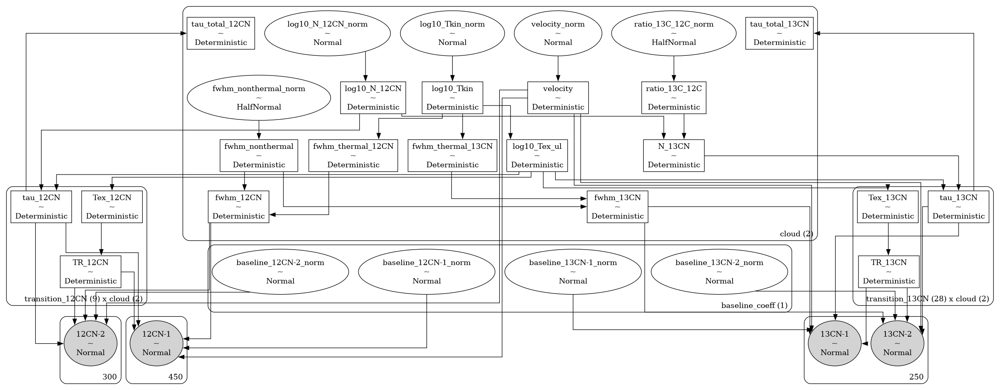

# bayes_cn_hfs <!-- omit in toc -->


[](https://bayes-cn-hfs.readthedocs.io/en/latest/?badge=latest)
[](https://codecov.io/gh/tvwenger/bayes_cn_hfs)

A Bayesian CN Hyperfine Spectral Model

`bayes_cn_hfs` implements models to infer the physics of the interstellar medium from hyperfine spectral observations as well as the carbon isotopic ratio from observations of CN and 13CN.

- [Installation](#installation)
  - [Basic Installation](#basic-installation)
  - [Development installation](#development-installation)
- [Notes on Physics \& Radiative Transfer](#notes-on-physics--radiative-transfer)
- [Models](#models)
  - [`HFSModel`](#hfsmodel)
  - [`HFSAnomalyModel`](#hfsanomalymodel)
  - [`CNRatioModel`](#cnratiomodel)
  - [`CNRatioAnomalyModel`](#cnratioanomalymodel)
  - [`ordered`](#ordered)
- [Syntax \& Examples](#syntax--examples)
- [Issues and Contributing](#issues-and-contributing)
- [License and Copyright](#license-and-copyright)


# Installation

## Basic Installation

Install with `pip` in a `conda` virtual environment:
```
conda create --name bayes_cn_hfs -c conda-forge pymc pip
conda activate bayes_cn_hfs
pip install bayes_cn_hfs
```

## Development installation
Alternatively, download and unpack the [latest release](https://github.com/tvwenger/bayes_cn_hfs/releases/latest), or [fork the repository](https://docs.github.com/en/pull-requests/collaborating-with-pull-requests/working-with-forks/fork-a-repo) and contribute to the development of `bayes_cn_hfs`!

Install in a `conda` virtual environment:
```
conda env create -f environment.yml
conda activate bayes_cn_hfs-dev
pip install -e .
```

# Notes on Physics & Radiative Transfer

All models in `bayes_cn_hfs` apply the same physics and equations of radiative transfer.

The transition optical depth is taken from [Magnum & Shirley (2015) equation 29](https://ui.adsabs.harvard.edu/abs/2015PASP..127..266M/abstract).

The radiative transfer is calculated explicitly assuming an off-source background temperature `bg_temp` (see below) similar to [Magnum & Shirley (2015) equation 23](https://ui.adsabs.harvard.edu/abs/2015PASP..127..266M/abstract). By default, the clouds are ordered from *nearest* to *farthest*, so optical depth effects (i.e., self-absorption) may be present.

Non-LTE effects are modeled by considering the column densities of all states and self-consistently solving for the excitation temperature of each transition. There are two parameters that handle non-LTE effects. When `assume_LTE = True`, the average excitation temperature is fixed to that of the kinetic temperature of the cloud. This is the "strong LTE" assumption. Independently, hyperfine anomalies (i.e., different excitation temperatures for each hyperfine transition) can be modeled by setting a non-zero prior for the parameter `log_boltz_factor` (for `CNModel`) or `log_boltz_factor_12CN` (for `CNRatioModel`). When the prior for this parameter is zero, then the excitation temperatures of all transitions are the same (the constant excitation temperature (CTEX) assumption). When the prior for this parameter is positive, however, then the excitation temperatures of the different transitions need not be constant. One can still set `assume_LTE = True` and allow hyperfine anomalies. This is the "weak LTE" assumption.

Notably, since these are *forward models*, we do not make assumptions regarding the optical depth or the Rayleigh-Jeans limit. These effects are *predicted* by the model. There is one exception: the `ordered` argument, [described below](#ordered).

# Models

The models provided by `bayes_cn_hfs` are implemented in the [`bayes_spec`](https://github.com/tvwenger/bayes_spec) framework. `bayes_spec` assumes that the source of spectral line emission can be decomposed into a series of "clouds", each of which is defined by a set of model parameters. Here we define the models available in `bayes_cn_hfs`.

## `CNModel`

The basic model is `HFSModel`, a general purpose model for modelling any hyperfine spectral data. The model assumes that the emission can be explained by the radiative transfer of emission through a series of isothermal, homogeneous clouds (in local thermodynamic equilibrium, LTE) as well as a polynomial spectral baseline. The following diagram demonstrates the relationship between the free parameters (empty ellipses), deterministic quantities (rectangles), model predictions (filled ellipses), and observations (filled, round rectangles). Many of the parameters are internally normalized (and thus have names like `_norm`). The subsequent tables describe the model parameters in more detail.


| Cloud Parameter<br>`variable` | Parameter                               | Units    | Prior, where<br>($p_0, p_1, \dots$) = `prior_{variable}`     | Default<br>`prior_{variable}` |
| :---------------------------- | :-------------------------------------- | :------- | :----------------------------------------------------------- | :---------------------------- |
| `log10_N`                     | Total column density                    | `cm-2`   | $\log_{10}N \sim {\rm Normal}(\mu=p_0, \sigma=p_1)$          | `[14.0, 1.0]`                 |
| `log10_tex`                   | Excitation temperature                  | `K`      | $\log_{10}T_{\rm ex} \sim {\rm Normal}(\mu=p_0, \sigma=p_1)$ | `[1.0, 0.1]`                  |
| `log10_fwhm`                  | FWHM line width                         | `km s-1` | $\Delta V \sim {\rm HalfNormal}(\sigma=p)$                   | `1.0`                         |  |
| `velocity`                    | Velocity (same reference frame as data) | `km s-1` | $V \sim {\rm Normal}(\mu=p_0, \sigma=p_1)$                   | `[0.0, 10.0]`                 |

| Hyper Parameter<br>`variable` | Parameter                                   | Units | Prior, where<br>($p_0, p_1, \dots$) = `prior_{variable}` | Default<br>`prior_{variable}` |
| :---------------------------- | :------------------------------------------ | :---- | :------------------------------------------------------- | :---------------------------- |
| `rms`                         | Spectral rms noise                          | `K`   | ${\rm rms} \sim {\rm HalfNormal}(\sigma=p)$              | `0.01`                        |
| `baseline_coeffs`             | Normalized polynomial baseline coefficients | ``    | $\beta_i \sim {\rm Normal}(\mu=0.0, \sigma=p_i)$         | `[1.0]*baseline_degree`       |

## `HFSAnomalyModel`

`HFSAnomalyModel` is like `HFSModel`, except that it allows for the excitation temperature of individual hyperfine components to deviate from the average cloud excitation temperature. The following table describes the additional parameters (in addition to those in `HFSModel`).


| Cloud Parameter<br>`variable` | Parameter                      | Units | Prior, where<br>($p_0, p_1, \dots$) = `prior_{variable}`        | Default<br>`prior_{variable}` |
| ----------------------------- | ------------------------------ | ----- | --------------------------------------------------------------- | ----------------------------- |
| `tex_anomaly`                 | Excitation temperature anomaly | `K`   | $T_{\rm ex} \sim {\rm Normal}(\mu=T_{\rm ex, cloud}, \sigma=p)$ | `1.0`                         |

## `CNRatioModel`

`bayes_cn_hfs` also implements `CNRatioModel`, a model to infer the $^{12}{\rm C}/^{13}{\rm C}$ isotopic ratio from hyperfine observations of ${\rm CN}$ and $^{13}{\rm CN}$. Both species are assumed to be described by the same physical conditions (excitation temperature, line width, etc.).



| Cloud Parameter<br>`variable` | Parameter                                             | Units    | Prior, where<br>($p_0, p_1, \dots$) = `prior_{variable}`     | Default<br>`prior_{variable}` |
| :---------------------------- | :---------------------------------------------------- | :------- | :----------------------------------------------------------- | :---------------------------- |
| `log10_N_12CN`                | ${\rm CN}$ Column density                             | `cm-2`   | $\log_{10}N_{\rm CN} \sim {\rm Normal}(\mu=p_0, \sigma=p_1)$ | `[14.0, 1.0]`                 |
| `log10_tex`                   | Excitation temperature                                | `K`      | $\log_{10}T_{\rm ex} \sim {\rm Normal}(\mu=p_0, \sigma=p_1)$ | `[1.0, 0.1]`                  |
| `log10_fwhm`                  | FWHM line width                                       | `km s-1` | $\Delta V \sim {\rm HalfNormal}(\sigma=p)$                   | `1.0`                         |  |
| `velocity`                    | Velocity (same reference frame as data)               | `km s-1` | $V \sim {\rm Normal}(\mu=p_0, \sigma=p_1)$                   | `[0.0, 10.0]`                 |
| `ratio_13C_12C`               | $^{13}{\rm C}/^{12}{\rm C}$ abundance ratio by number | ``       | $^{13}{\rm C}/^{12}{\rm C} \sim {\rm HalfNormal}(\sigma=p)$  | `0.01`                        |

| Hyper Parameter<br>`variable` | Parameter                                   | Units | Prior, where<br>($p_0, p_1, \dots$) = `prior_{variable}` | Default<br>`prior_{variable}` |
| :---------------------------- | :------------------------------------------ | :---- | :------------------------------------------------------- | :---------------------------- |
| `rms_12CN`                    | ${\rm CN}$ spectral rms noise               | `K`   | ${\rm rms} \sim {\rm HalfNormal}(\sigma=p)$              | `0.01`                        |
| `rms_13CN`                    | $^{13}{\rm CN}$ spectral rms noise          | `K`   | ${\rm rms} \sim {\rm HalfNormal}(\sigma=p)$              | `0.01`                        |
| `baseline_coeffs`             | Normalized polynomial baseline coefficients | ``    | $\beta_i \sim {\rm Normal}(\mu=0.0, \sigma=p_i)$         | `[1.0]*baseline_degree`       |

## `CNRatioAnomalyModel`

`CNRatioAnomalyModel` is like `CNRatioModel`, except that it adds hyperfine anomaly parameters to the $^{12}{\rm CN}$ hyperfine transitions *only*. The following table describes this new parameter.


| Cloud Parameter<br>`variable` | Parameter                         | Units | Prior, where<br>($p_0, p_1, \dots$) = `prior_{variable}`            | Default<br>`prior_{variable}` |
| ----------------------------- | --------------------------------- | ----- | ------------------------------------------------------------------- | ----------------------------- |
| `tex_12CN_anomaly`            | CN excitation temperature anomaly | `K`   | $T_{\rm ex, CN} \sim {\rm Normal}(\mu=T_{\rm ex, cloud}, \sigma=p)$ | `1.0`                         |

## `ordered`

An additional parameter to `set_priors` for these models is `ordered`. By default, this parameter is `False`, in which case the order of the clouds is from nearest to farthest. Sampling from these models can be challenging due to the labeling degeneracy: if the order of clouds does not matter (i.e., the emission is optically thin), then each Markov chain could decide on a different, equally-valid order of clouds.

If we assume that the emission is optically thin, then we can set `ordered=True`, in which case the order of clouds is restricted to be increasing with velocity. This assumption can *drastically* improve sampling efficiency. When `ordered=True`, the `velocity` prior is defined differently:

| Cloud Parameter<br>`variable` | Parameter                               | Units    | Prior, where<br>($p_0, p_1, \dots$) = `prior_{variable}`             | Default<br>`prior_{variable}` |
| :---------------------------- | :-------------------------------------- | :------- | :------------------------------------------------------------------- | :---------------------------- |
| `velocity`                    | Velocity (same reference frame as data) | `km s-1` | $V_i \sim p_0 + \sum_0^{i-1} V_i + {\rm Gamma}(\alpha=2, \beta=p_1)$ | `[0.0, 10.0]`                 |

# Syntax & Examples

See the various tutorial notebooks under [docs/source/notebooks](https://github.com/tvwenger/bayes_cn_hfs/tree/main/docs/source/notebooks). Tutorials and the full API are available here: https://bayes-cn-hfs.readthedocs.io.

# Issues and Contributing

Anyone is welcome to submit issues or contribute to the development
of this software via [Github](https://github.com/tvwenger/bayes_cn_hfs).

# License and Copyright

Copyright (c) 2024 Trey Wenger

GNU General Public License v3 (GNU GPLv3)

This program is free software: you can redistribute it and/or modify
it under the terms of the GNU General Public License as published
by the Free Software Foundation, either version 3 of the License,
or (at your option) any later version.

This program is distributed in the hope that it will be useful,
but WITHOUT ANY WARRANTY; without even the implied warranty of
MERCHANTABILITY or FITNESS FOR A PARTICULAR PURPOSE.  See the
GNU General Public License for more details.

You should have received a copy of the GNU General Public License
along with this program.  If not, see <http://www.gnu.org/licenses/>.